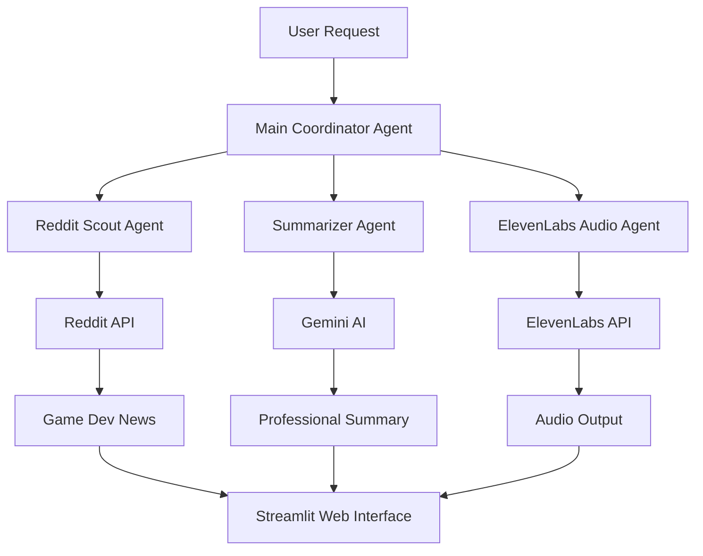

# 🚀 A2A Systems - Multi-Agent Platform with ElevenLabs Integration

A production-ready **Agent-to-Agent (A2A)** multi-agent system powered by Google ADK with professional **ElevenLabs text-to-speech integration**.

[](https://opensource.org/licenses/MIT)
[](https://www.python.org/downloads/)
[](https://google.github.io/adk-docs/)
[](https://elevenlabs.io/)

## ✨ Features

### 🎯 **Core Agents**
- **🔍 Reddit Scout Agent** - Real-time game development news from Reddit API
- **📝 Summarizer Agent** - AI-powered news summarization with multiple styles
- **🎵 ElevenLabs Audio Agent** - Professional text-to-speech with 9 voice options
- **🎮 Main Coordinator Agent** - Intelligent agent orchestration

### 🎬 **Complete Pipeline**
- **Reddit → Summarizer → Audio** - End-to-end news workflow
- **Real-time processing** - Live Reddit data to professional audio
- **Voice selection** - Choose from 9 ElevenLabs voices
- **Browser playback** - Instant audio streaming in web interface

### 🖥️ **Professional Interfaces**
- **Streamlit Web Apps** - Modern, responsive user interfaces
- **A2A Protocol** - Standalone agent services with REST APIs
- **Interactive demos** - Complete workflow visualization
- **Audio management** - Download and playback functionality

## 🎵 **ElevenLabs Integration**

Professional text-to-speech powered by ElevenLabs API:

### Available Voices
| Voice | Style | Best For |
|-------|-------|----------|
| **Rachel** | Professional, clear | News, announcements |
| **Antoni** | Deep, authoritative | Serious content |
| **Domi** | Warm, conversational | Casual updates |
| **Bella** | Friendly, engaging | Educational content |
| **Elli** | Bright, energetic | Gaming content |
| **Josh** | Friendly, casual | Social media |
| **Arnold** | Strong, confident | Technical content |
| **Adam** | Smooth, professional | Business content |
| **Sam** | Natural, versatile | General purpose |

## 🚀 Quick Start

### Prerequisites
- Python 3.9+
- Google AI API key
- ElevenLabs API key (for audio features)
- Reddit API credentials (for real data)

### Installation

1. **Clone the repository:**
   ```bash
   git clone https://github.com/SawsanAbdulbari/a2asys.git
   cd a2asys
   ```

2. **Create virtual environment:**
   ```bash
   python -m venv .venv
   # Windows
   .venv\Scripts\activate
   # macOS/Linux
   source .venv/bin/activate
   ```

3. **Install dependencies:**
   ```bash
   pip install -r requirements.txt
   ```

4. **Configure environment:**
   ```bash
   cp .env.example .env
   # Edit .env with your API keys
   ```

### 🎯 **Test the System**

```bash
# Test all components
python agents/test_final_working.py

# Test ElevenLabs integration  
python agents/test_elevenlabs_integration.py

# Test Reddit API
python agents/test_reddit_api.py
```

Expected: ✅ **All tests passing**

## 🖥️ **Web Interfaces**

### 1. Reddit Scout Interface
```bash
streamlit run apps/reddit_scout_app.py
```
- Professional Reddit news interface
- Multiple subreddit support (gamedev, unity3d, unrealengine)
- Real-time API status monitoring

### 2. Complete Pipeline Demo
```bash
streamlit run apps/enhanced_pipeline_demo.py
```
- Full Reddit → Summary → Audio workflow
- Voice selection and style options
- **Real audio playback in browser**

### 3. ElevenLabs Audio Interface
```bash
streamlit run apps/elevenlabs_audio_app.py
```
- Professional TTS interface
- 9 voice options with previews
- Audio download functionality

## 🔧 **A2A Services**

### Reddit Scout Service
```bash
python -m agents.reddit_scout.run_agent
```

### Audio Agent Service
```bash
python -m agents.audio.__main__
```
Available endpoints:
- `POST /speak` - Generate speech
- `GET /voices` - List available voices
- `GET /status` - Agent health check

## 📊 **System Architecture**



## 🛠️ **Configuration**

### Environment Variables
```env
# Required
GOOGLE_API_KEY=your_google_ai_key
ELEVENLABS_API_KEY=your_elevenlabs_key

# Optional - Reddit API (for real data)
REDDIT_CLIENT_ID=your_reddit_client_id
REDDIT_CLIENT_SECRET=your_reddit_client_secret
REDDIT_USER_AGENT=your_app_user_agent

# Server Configuration
ELEVENLABS_HOST=127.0.0.1
ELEVENLABS_PORT=8004
AUDIO_OUTPUT_DIR=/path/to/audio/files
```

## 🧪 **Testing**

### Comprehensive Test Suite
```bash
# All components
python agents/test_final_working.py

# ElevenLabs integration
python agents/test_elevenlabs_integration.py

# PowerShell test suite
.\scripts\test_all.ps1
```

### Expected Results
- ✅ **5/5 core agents working**
- ✅ **7/7 ElevenLabs tests passing**
- ✅ **Real Reddit API connectivity**
- ✅ **Professional audio generation**

## 📁 **Project Structure**

```
a2asys/
├── agents/                     # Core agent implementations
│   ├── reddit_scout/           # Reddit API integration
│   ├── audio/                  # ElevenLabs TTS agent
│   ├── summarizer/             # AI summarization
│   └── async_reddit_scout/     # Alternative implementation
├── apps/                       # Streamlit web interfaces
│   ├── reddit_scout_app.py     # Reddit news interface
│   ├── elevenlabs_audio_app.py # Audio generation UI
│   └── enhanced_pipeline_demo.py # Complete workflow demo
├── common/                     # Shared utilities
│   └── a2a_server.py          # A2A protocol helpers
├── scripts/                    # Testing and deployment
└── requirements.txt           # Dependencies
```

## 🔄 **Workflow Examples**

### Game Development News Bulletin
1. **Fetch** latest posts from r/gamedev
2. **Summarize** in professional news style
3. **Generate** audio with Rachel voice
4. **Stream** in web interface with download option

### Custom Audio Messages
1. **Enter** custom text in audio interface
2. **Select** voice (Antoni for authority, Elli for energy)
3. **Generate** professional TTS
4. **Download** MP3 file

## 🚀 **Production Deployment**

### Docker Support
```dockerfile
FROM python:3.9-slim
COPY . /app
WORKDIR /app
RUN pip install -r requirements.txt
EXPOSE 8004
CMD ["python", "-m", "agents.audio.__main__"]
```

### Environment Setup
- Set production API keys
- Configure output directories
- Enable monitoring endpoints
- Set up reverse proxy for web apps

## 🤝 **Contributing**

1. Fork the repository
2. Create feature branch: `git checkout -b feature/amazing-feature`
3. Commit changes: `git commit -m 'Add amazing feature'`
4. Push to branch: `git push origin feature/amazing-feature`
5. Open Pull Request

## 📄 **License**

This project is licensed under the MIT License - see the [LICENSE](LICENSE) file for details.

## 🙏 **Acknowledgments**

- **Google ADK** - Agent Development Kit framework
- **ElevenLabs** - Professional text-to-speech API
- **Reddit API** - Real-time community data
- **Streamlit** - Beautiful web interfaces

## 📞 **Support**

- 📧 **Issues**: [GitHub Issues](https://github.com/SawsanAbdulbari/a2asys/issues)
- 📚 **Documentation**: See individual module READMEs
- 🔧 **Troubleshooting**: Check `ELEVENLABS_INTEGRATION_GUIDE.md`

---

**🎵 A2A Systems** | Multi-Agent Platform | Production Ready | Real Audio Integration